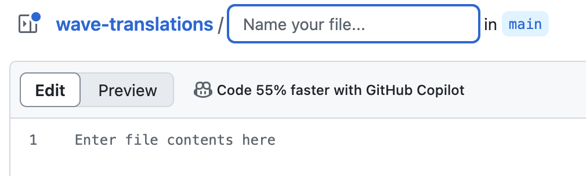

# wave-translations

Localised translations for wave, expanding its usability.

## <a id="welcome"><a/> Welcome!

Thank you for choosing to visit this repository and translating wave to make it more accessible to all users! wave translators will also get a special role in the [Comet Client Discord](https://discord.gg/YcrQTWmkaZ) and the wave Discord should there be one in the future.

## <a id="index"><a/> Index

[Getting Started:](#getting-started)

- [Creating a GitHub account](#creating-gh)
- [Forking](#forking)
- [Local Setup](#local)
- [The Translation Files](#files)

[Translation Process:](#translation)

- [Local Workflow (Recommended):](#local-wf)
- [Website Workflow:](#website)
- [Creating a Pull Request](#pull)

[Guidelines](#guidelines)<br/>
[FAQ](#faq)

## <a id="getting-started"><a/> Getting Started:

### <a id="creating-gh"><a/> Creating a GitHub account:

To start off, you need a GitHub account for this process. If you already have one, go straight to [Forking](#forking).<br/>

First, visit the [GitHub Login Page](https://github.com/login), and press the "Create an account" button:<br/>


And enter any required details (Email Address, Password).

### <a id="forking"><a/> Forking

Forking is the process of making a copy of a repository (Collection of code) with your personal changes. This will come into place later once you submit your contributions.<br/>

A fork is a copy of the code repository under your own GitHub account. This allows changes to be made without affecting the main repository, which is vital for keeping the core language files of wave.<br/>

To begin, go to the [repository link](https://github.com/benjisqt/wave-translations) whilst signed into your GitHub account.<br/>

Once on this page, click the Fork button as shown in the screenshot below:<br/>


This will create a copy of the wave-translations repository in your own GitHub account, allowing you to add your translations.<br/>

### <a id="local"><a/> Local Setup

While you can make your own translations via the GitHub website, it is not recommended because the basic text editor does not have JSON syntax, so you are unable to make sure the file is properly formatted.<br/>

For local setup, you'll need Git. Git is a command-line tool used to manage GitHub repositories, or mainly in this case, cloning repositories, since you will need the translation repository on your computer itself to edit the files locally.<br/>

To start with Git, visit the [Git downloads page](https://git-scm.com/downloads) and select your platform, and follow the instructions to download and install Git onto your system.<br/>

Once Git has been installed, open a Terminal or Command Prompt, and enter the following:<br/>
`git clone https://github.com/<your username>/wave-translations`<br/>

⚠️ You **must** clone your own repository and not the official wave-translations one by benjisqt. This is because you need to make local changes and request to push them (add your changes) to the main repository, you can't edit the main repository's files directly.<br/>

As for a way to edit the local files, it is highly recommended that you use a code editor like _Sublime Text_, _Visual Studio Code_ or _Atom_. The downloads for those can be found on the internet, however Atom has been discontinued.<br/>

### <a id="files"><a/> The Translation Files

The translation files are structured and formatted as **JSON** files.<br/>

**JSON** files organise data into objects, keys and values, like in a dictionary! For a bit of comparison, say Objects are the letter of the word, the key is the word, and the value is the definition. _This is an analogy of how JSON files are formatted._<br/>

Below is an example of a JSON file to give you a better idea of how they are formatted:<br/>

```json
{
    "example": {} // object
    "e": "a" // 1st value: key, 2nd: value
}
```

Each language in wave has its own JSON file (e.g. `en.json`, `de.json` etc). These files contain values that are specific to that language.<br/>

⚠️ Warning: The keys must **NOT** be translated. These are necessary for wave to read the language files to find the correct text, and **will** malfunction if not formatted correctly. Keys are always encoded in double strings (e.g. `"hello"`).<br/>

The _value_ is the property that needs to be changed. Like keys, values are also formatted in double strings. Keys and values usually go together in JSON files as shown below:<br/>

```json
{
  "welcome_message": "Welcome to the server, {username}!"
  // welcome_message is the key.
  // "Welcome to the server, {username!}" is the value, and the one that needs to be translated.
}
```

Some values may contain placeholders such as {username}. These values must _not_ be changed, as they are substituted in by wave in the main code when it reads the language files.<br/>

To add a new language file, copy the `en.json` file as a base, rename it to the correct language code (e.g. en for English, de for German), and translate the _values_ in the new file.<br/>

## <a id="translation"><a/> Translation Process:

### <a id="local-wf"><a/> Local Workflow

Clone your repository if you haven't already:<br/>

```
git clone https://github.com/<your username>/wave-translations
```

If you haven't already, copy the `en.json` file as a base for your language translations, rename it to the correct language code (e.g. en for English, de for German).<br/>

Open your JSON file and translate the _values_ whilst preserving the _keys_ and making sure they stay the same. Use the comments in the en.json file for context on what to translate, as well as as the [Translation Files](#the-translation-files) section of this guide.<br/>

Once you've finished making all of your changes and translating the values, it's time to push!<br/>

To push to your repository, open a Terminal or Command Prompt and navigate to your repository's folder, making sure it is the folder that has the language .JSON files in them.<br/>

You can either navigate using `cd` in Terminal/CMD or open a Terminal/CMD in the folder where your files are.<br/>

To open one in the folder where your files are:<br/>

- Open an Explorer/Finder window.
- Navigate to your folder where the .JSON translations are.
- (For Windows ONLY) Right click, and click "Open in Terminal"
- (For macOS ONLY) Hold `option` (alt), and a file path should appear at the bottom. Right click on the right-most folder, and click "Open In Terminal".<br/>

macOS File Path Way:<br/>
<br/>

Once your Terminal/CMD is open, type the following command:<br/>

```
git commit -m "Added <language> translation"
```

You can customise the text to say whatever you want, just make sure it's short.<br/>

From here, simply type `git push`. This will push your changes from your computer to your repository on GitHub.<br/>

Done! Now, just visit [Creating a Pull Request](#pull)!

### <a id="website"><a/> Website Workflow

The website workflow way is not recommended, but it is the shorter way of doing it.<br/>

The reason why it's not recommended is because GitHub just uses a basic text editor and not a one optimised for **JSON** files, so there may be syntax errors in your code that could cause the bot to crash.<br/>

Nonetheless, if you know what you're doing, or you don't want to install all that software, this is still a good option.<br/>

To get started, follow Steps 1 and 2 from [Getting Started](#getting-started).<br/>

Next, you'll want to go into your repository, and go into the `en.json` file. Copy all of the contents using the "Copy raw file" button shown below:<br/>


This should copy all of the contents of the file.<br/>
From here, you'll want to go back into your repository, and click the "Add File" button, and name it according to your language:<br/>
<br/>

<br/>
Now, using the `en.json` contents, paste it into the file. **Also, make sure your file ends with .JSON, GitHub will not add it for you.**<br/>

Now, simply make your translations, and commit your changes by pressing the green button named accordingly.<br/>

In the settings, you can add a commit description if you wish, but you don't have to. The main thing is the commit message, make sure this is filled in with useful information (e.g. "Added German translations." or something of the like).

### <a id="pull"><a/> Create a Pull Request

Once you've made your changes, you'll want to make a Pull Request to the main repository, so I can review and accept/deny the changes, and incorporate them into wave.<br/>

To do this, you'll first want to go to your forked repository, commonly under `https://github.com/<your username>/wave-translations`.<br/>

Once your changes have been pushed following the steps in your Local or Website workflow, you should see a notification about your branch. Click "Compare and Pull Request".<br/>

From here, review your changes, make sure everything's all good, add a descriptive title and click "Create Pull Request".

## <a id="guidelines"><a/> Guidelines

There are some guidelines you need to follow as a wave translation contributor.<br/>

You must follow these core principles to make sure your translation is accepted:</br>

- Consistency: Use consistent translations throughout the file(s) that you create.
- Accuracy: Make sure the translations accurately reflect the meaning of the original English text.
- Natural Language: Be mindful of cultural differences and avoid any offensive language.

## <a id="faq"><a/> FAQ

Here are some frequently asked questions you may ask yourself:<br/>

- **What if I don't know how to translate a specific word?** Use online dictionaries or translation tools, but always review the final translation to ensure accuracy.
- **Can I translate into multiple languages?** Absolutely, in fact we encourage it! However, split your translations into separate files.
- **How will I be credited?** When a new pull request is accepted, you will be thanked and given a Translator role in the server. You will also gain early access to new wave features.
- **What if I make a mistake?** Feel free to make a new Pull Request with your fixes, or I will manually make the changes before pushing them.

## Thank you!

Thank you for choosing to read this and make your contributions to wave and its users. By adding new languages, you are supporting the community and making wave more accessible to new users every single day, and I can't thank you enough!
